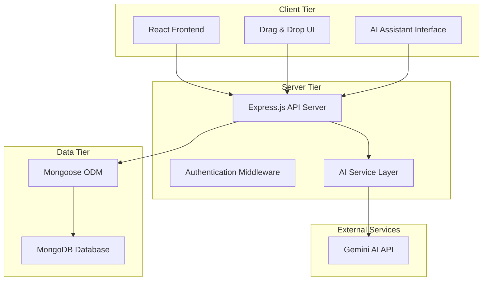

# Design Document

## Overview

The Project & Task Management System is a full-stack web application built with the MERN stack, featuring a Kanban-style interface and AI-powered task analysis. The system follows a three-tier architecture with a React frontend, Express.js backend, and MongoDB database, enhanced with Gemini AI integration for intelligent task management features.

## Architecture

### High-Level Architecture



### Technology Stack

- **Frontend**: React.js with modern hooks, React Router for navigation
- **Backend**: Node.js with Express.js framework
- **Database**: MongoDB with Mongoose ODM
- **AI Integration**: Google Gemini API
- **Drag & Drop**: @hello-pangea/dnd library
- **HTTP Client**: Axios for API communication
- **Styling**: CSS modules or styled-components for responsive design

## Components and Interfaces

### Frontend Components

#### Core Components
- **App.jsx**: Main application component with routing
- **Header.jsx**: Navigation and branding component
- **ProjectList.jsx**: Displays all projects in a grid/list view
- **ProjectBoard.jsx**: Main Kanban board container
- **Column.jsx**: Individual status column component
- **TaskCard.jsx**: Individual task card with drag functionality
- **TaskModal.jsx**: Full task details and editing interface
- **AiAssistant.jsx**: AI-powered analysis and Q&A interface

#### Component Hierarchy
```
App
├── Header
├── ProjectList
└── ProjectBoard
    ├── Column (multiple)
    │   └── TaskCard (multiple)
    ├── TaskModal
    └── AiAssistant
```

### Backend API Structure

#### RESTful Endpoints

**Project Management**
- `GET /api/projects` - Retrieve all projects
- `POST /api/projects` - Create new project
- `GET /api/projects/:id` - Get specific project with columns
- `PUT /api/projects/:id` - Update project details
- `DELETE /api/projects/:id` - Delete project and all tasks

**Task Management**
- `GET /api/projects/:projectId/tasks` - Get all tasks for project
- `POST /api/projects/:projectId/tasks` - Create new task
- `GET /api/tasks/:id` - Get specific task details
- `PUT /api/tasks/:id` - Update task details
- `DELETE /api/tasks/:id` - Delete task
- `PATCH /api/projects/:projectId/tasks/reorder` - Reorder tasks (drag & drop)

**AI Integration**
- `POST /api/ai/summary` - Generate project task summary
- `POST /api/ai/question` - Ask questions about tasks/projects

### Service Layer Architecture

#### AI Service Module
```javascript
class AIService {
  async summarizeProject(projectId)
  async answerQuestion(question, context)
  async extractTasks(freeText) // Optional feature
}
```

#### Task Service Module
```javascript
class TaskService {
  async reorderTasks(projectId, reorderData)
  async getTasksByProject(projectId)
  async updateTaskStatus(taskId, newStatus)
}
```

## Data Models

### MongoDB Schema Design

#### Project Schema
```javascript
const ProjectSchema = new mongoose.Schema({
  name: { 
    type: String, 
    required: true,
    trim: true,
    maxlength: 100
  },
  description: { 
    type: String, 
    default: "",
    maxlength: 500
  },
  createdAt: { 
    type: Date, 
    default: Date.now 
  },
  columns: [{
    _id: false,
    id: { 
      type: String, 
      required: true 
    }, // "todo", "inprogress", "done"
    title: { 
      type: String, 
      required: true 
    },
    order: { 
      type: Number, 
      default: 0 
    }
  }]
});
```

#### Task Schema
```javascript
const TaskSchema = new mongoose.Schema({
  projectId: { 
    type: mongoose.Schema.Types.ObjectId, 
    ref: 'Project', 
    required: true 
  },
  title: { 
    type: String, 
    required: true,
    trim: true,
    maxlength: 200
  },
  description: { 
    type: String, 
    default: "",
    maxlength: 1000
  },
  status: { 
    type: String, 
    required: true,
    enum: ['todo', 'inprogress', 'done']
  },
  order: { 
    type: Number, 
    default: 0 
  },
  createdAt: { 
    type: Date, 
    default: Date.now 
  },
  updatedAt: { 
    type: Date, 
    default: Date.now 
  }
});
```

### Data Relationships
- Projects have a one-to-many relationship with Tasks
- Tasks reference their parent Project via `projectId`
- Column definitions are embedded within Project documents
- Task ordering is maintained per column using the `order` field

## Error Handling

### Frontend Error Handling
- **API Error Boundaries**: React error boundaries to catch and display API failures
- **Validation Feedback**: Real-time form validation with user-friendly messages
- **Network Error Recovery**: Retry mechanisms for failed API calls
- **Optimistic UI Updates**: Immediate UI feedback with rollback on failure

### Backend Error Handling
- **Centralized Error Middleware**: Express middleware for consistent error responses
- **Input Validation**: Joi or express-validator for request validation
- **Database Error Handling**: Mongoose error handling with meaningful messages
- **AI Service Error Handling**: Graceful degradation when Gemini API is unavailable

### Error Response Format
```javascript
{
  success: false,
  error: {
    message: "User-friendly error message",
    code: "ERROR_CODE",
    details: {} // Additional context for debugging
  }
}
```

## Testing Strategy

### Frontend Testing
- **Unit Tests**: Jest and React Testing Library for component testing
- **Integration Tests**: Testing component interactions and API integration
- **E2E Tests**: Cypress for critical user flows (create project → add tasks → drag & drop)
- **Visual Regression**: Screenshot testing for UI consistency

### Backend Testing
- **Unit Tests**: Jest for service layer and utility functions
- **Integration Tests**: Supertest for API endpoint testing
- **Database Tests**: In-memory MongoDB for isolated testing
- **AI Integration Tests**: Mock Gemini API responses for consistent testing

### Test Coverage Goals
- Minimum 80% code coverage for critical business logic
- 100% coverage for API endpoints
- Complete E2E coverage for core user workflows

## Security Considerations

### API Security
- **Environment Variables**: Secure storage of Gemini API keys and database credentials
- **CORS Configuration**: Proper CORS setup for frontend-backend communication
- **Rate Limiting**: API rate limiting to prevent abuse and control Gemini API costs
- **Input Sanitization**: Prevent NoSQL injection and XSS attacks

### Data Security
- **Database Security**: MongoDB connection with authentication
- **Data Validation**: Server-side validation for all inputs
- **Error Information**: Avoid exposing sensitive information in error messages

## Performance Optimization

### Frontend Performance
- **Code Splitting**: Lazy loading for different routes
- **Memoization**: React.memo and useMemo for expensive operations
- **Virtual Scrolling**: For projects with large numbers of tasks
- **Optimistic Updates**: Immediate UI feedback for better user experience

### Backend Performance
- **Database Indexing**: Indexes on frequently queried fields (projectId, status)
- **Caching**: Redis caching for frequently accessed data
- **Connection Pooling**: MongoDB connection pooling for better resource utilization
- **AI Response Caching**: Cache Gemini responses for repeated queries

### Gemini AI Optimization
- **Token Management**: Minimize token usage through context optimization
- **Response Caching**: Cache AI responses for similar queries
- **Rate Limit Management**: Implement queuing for AI requests
- **Cost Monitoring**: Track and limit AI API usage

## Deployment Architecture

### Development Environment
- **Local Development**: Docker Compose for consistent development environment
- **Environment Configuration**: Separate configs for development, staging, production

### Production Deployment
- **Frontend**: Vercel or Netlify for static React app hosting
- **Backend**: Railway, Render, or Heroku for Node.js API server
- **Database**: MongoDB Atlas for managed database hosting
- **Environment Variables**: Secure management of API keys and connection strings

### CI/CD Pipeline
- **GitHub Actions**: Automated testing and deployment
- **Build Process**: Automated builds with environment-specific configurations
- **Health Checks**: Monitoring and alerting for service availability